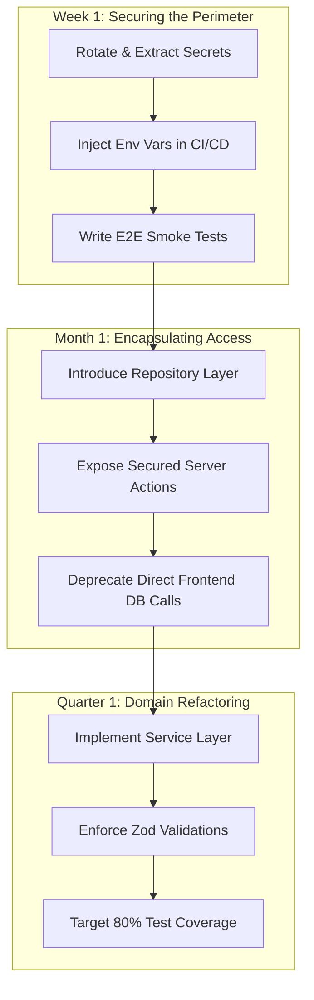

# Task B: Inherit & Improve - Technical Assessment & Migration Strategy

This document provides a comprehensive technical assessment, migration roadmap, architectural refactoring demo, and engineering standards proposal for a legacy CRM system containing critical security, stability, and maintainability issues.

---

## 1. Technical Risk Assessment

### Identified Flaws & Risk Matrix

| Flaw | Category | Risk Profile | Priority | Impact / Risk of Leaving in Place |
| :--- | :--- | :--- | :--- | :--- |
| **Exposed Secrets in Repo** | Security | Critical | **Priority 1** (Immediate) | Hardcoded API keys, database credentials, or JWT signing keys in source control can lead to data breaches, compliance failures (GDPR/HIPAA), resource hijacking (crypto-mining), and brand damage. |
| **Direct DB Calls from Frontend** | Architecture | Critical | **Priority 2** (High) | Exposing database connections or allowing raw SQL queries directly from client components completely bypasses authentication and application constraints. Any user can write query requests, dump tables, drop schemas, or modify values at will. |
| **Business Logic inside Route Handlers** | Maintainability | Major | **Priority 3** (Medium) | Coupling validation, database transactions, permissions, and HTTP routing inside a single controller function makes testing impossible, blocks code reusability, and increases the likelihood of side effects during refactoring. |
| **Lack of Automated Test Coverage** | Reliability | Major | **Priority 4** (Medium) | Zero tests means there is no feedback loop. Any code change can trigger regression failures. Refactoring carries high risk, which slows down velocity and increases shipping anxiety. |

---

## 2. Phased Zero-Downtime Migration Plan

To restructure this production system without disrupting active customer operations, we will employ a **Phased Strangler Fig Pattern**, gradually routing requests away from legacy components onto clean, decoupled services.



### Phase 1: Week 1 – Securing the Perimeter
* **Goal**: Mitigate immediate security leaks and establish a testing safety net.
* **Tactics**:
  1. **Secret Extraction**: Move all exposed keys, tokens, and database URIs into `.env.local` (ignored by git).
  2. **Secret Rotation**: Revoke all exposed credentials (e.g. database password, third-party integration keys) and provision fresh credentials.
  3. **Git History Scrubbing**: Run `git-filter-repo` or BFG Repo-Cleaner to permanently purge historical commits containing the hardcoded secrets from git history.
  4. **Smoke Testing**: Write E2E smoke tests (using Playwright or Cypress) against active production staging to capture core user flows (Login, Lead Creation) as a safety net.

### Phase 2: Month 1 – Encapsulating Access
* **Goal**: Establish the API boundary and dismantle client-side database connections.
* **Tactics**:
  1. **Repository Pattern Introduction**: Encapsulate DB operations in a server-only data layer (`src/repositories`).
  2. **API/Server Actions Scaffolding**: Expose secure REST endpoints or Next.js Server Actions to act as intermediate gateways.
  3. **Frontend Refactoring**: Replace client-side DB drivers (e.g., raw SQL connections or client-side Prisma calls) with calls to the new secured backend gateways.
  4. **Regression Checking**: Run the smoke tests hourly during incremental deployment phases.

### Phase 3: Quarter 1 – Domain Refactoring & Automation
* **Goal**: Achieve clean domain-driven architecture and 80%+ test coverage.
* **Tactics**:
  1. **Service Layer Abstraction**: Move business validations, permissions checks, and event-trigger flows from route handlers to domain services (`src/services`).
  2. **Schema Validation Integration**: Implement Zod validation schemas on all input parameters.
  3. **Comprehensive Testing**: Write unit tests for services and integration tests for route boundaries.
  4. **CI/CD Integration**: Enforce formatting, lint checking, and test runs in the commit pipeline.

---

## 3. Concrete Refactor Demonstration

Below is a before/after demonstration of a lead deletion operation, showcasing how security, maintainability, and testability are improved.

### The "BEFORE" Code (Bad Practice)
* **Flaws**: Client-side DB client creation, exposed credentials, inline business logic, no input validation, and bypassable authorization checks.

```typescript
// src/app/components/DeleteLeadButton.tsx
// CRITICAL SECURITY RISK: Direct database invocation on client-side!
import { createClient } from "@supabase/supabase-js";

// Exposed credentials in codebase:
const supabase = createClient(
  "https://xyz-legacy-project.supabase.co",
  "eyJhbGciOiJIUzI1NiIsInR5cCI6IkpXVCJ9.exposed-anon-key-that-should-never-be-in-git"
);

export default function DeleteLeadButton({ leadId, userRole }: { leadId: string; userRole: string }) {
  const handleDelete = async () => {
    // Weak client-side permission enforcement (trivially bypassed by altering parameters)
    if (userRole !== "ADMIN") {
      alert("Unauthorized!");
      return;
    }

    // Direct database write bypasses server controls and activity tracking
    const { error } = await supabase
      .from("leads")
      .delete()
      .eq("id", leadId);

    if (error) {
      console.error("Deletion failed:", error);
    } else {
      alert("Deleted successfully!");
    }
  };

  return (
    <button onClick={handleDelete} className="bg-red-500 p-2 text-white">
      Delete Lead
    </button>
  );
}
```

---

### The "AFTER" Code (Clean Architecture)
To fix this, we decouple database access into a **Repository**, wrap the business operations in a **Service**, validate inputs using **Zod**, and run checks inside a secure **Server Action** with environment variables.

#### 1. Repository Layer (Database Encapsulation)
```typescript
// src/repositories/LeadRepository.ts
import { db } from "@/lib/db";

export class LeadRepository {
  static async findById(id: string) {
    return db.lead.findUnique({ where: { id } });
  }

  static async delete(id: string) {
    return db.lead.delete({ where: { id } });
  }
}
```

#### 2. Service Layer (Business Domain Logic)
```typescript
// src/services/LeadService.ts
import { LeadRepository } from "@/repositories/LeadRepository";
import { db } from "@/lib/db";

export class LeadService {
  static async deleteLead(leadId: string, actorId: string, actorRole: string) {
    // 1. Business authorization enforcement
    if (actorRole !== "ADMIN") {
      throw new Error("FORBIDDEN");
    }

    // 2. Fetch resource to verify existence
    const lead = await LeadRepository.findById(leadId);
    if (!lead) {
      throw new Error("NOT_FOUND");
    }

    // 3. Perform database deletion and transaction write
    await db.$transaction(async (tx) => {
      await tx.lead.delete({ where: { id: leadId } });
      
      // Audit log creation inside transaction to guarantee consistency
      await tx.activity.create({
        data: {
          leadId,
          actorId,
          actionType: "LEAD_DELETED",
          metadataJson: JSON.stringify({ company: lead.company, title: lead.title }),
        },
      });
    });

    return { success: true };
  }
}
```

#### 3. Secure Controller / Server Action
```typescript
// src/app/actions/leads.ts
"use server";

import { getSession } from "@/lib/auth";
import { LeadService } from "@/services/LeadService";
import { revalidatePath } from "next/cache";
import { z } from "zod";

const deleteLeadSchema = z.object({
  leadId: z.string().uuid("Invalid lead ID format"),
});

export async function deleteLeadAction(formData: { leadId: string }) {
  // 1. Get authenticated session (HTTP-Only Secure Cookie validation)
  const session = await getSession();
  if (!session) {
    return { error: "UNAUTHORIZED" };
  }

  // 2. Validate input schema
  const validation = deleteLeadSchema.safeParse(formData);
  if (!validation.success) {
    return { error: "BAD_REQUEST", details: validation.error.format() };
  }

  // 3. Delegate execution to domain service
  try {
    await LeadService.deleteLead(
      validation.data.leadId,
      session.id,
      session.role
    );
    
    revalidatePath("/dashboard");
    return { success: true };
  } catch (error: any) {
    if (error.message === "FORBIDDEN") return { error: "FORBIDDEN" };
    if (error.message === "NOT_FOUND") return { error: "NOT_FOUND" };
    return { error: "INTERNAL_SERVER_ERROR" };
  }
}
```

#### 4. Frontend Component (Presentation Layer)
```typescript
// src/app/components/DeleteLeadButton.tsx
"use client";

import React, { useState } from "react";
import { deleteLeadAction } from "@/app/actions/leads";
import { Trash } from "lucide-react";

export default function DeleteLeadButton({ leadId }: { leadId: string }) {
  const [loading, setLoading] = useState(false);

  const handleDelete = async () => {
    if (!confirm("Confirm lead deletion?")) return;
    setLoading(true);

    const result = await deleteLeadAction({ leadId });
    setLoading(false);

    if (result.success) {
      alert("Lead deleted.");
    } else {
      alert(`Error: ${result.error}`);
    }
  };

  return (
    <button
      onClick={handleDelete}
      disabled={loading}
      className="p-2 bg-rose-600 hover:bg-rose-500 text-white rounded transition-colors"
    >
      <Trash className="w-4 h-4" />
    </button>
  );
}
```

### Refactoring Rationale & Gains
1. **Security**: Supabase API keys are completely stripped from the client repository. Session tokens are checked server-side, preventing client-side parameters spoofing.
2. **Reliability**: Operations are run inside a database transaction (`$transaction`). If the lead deletion succeeds but the activity trail insertion fails, the database automatically rolls back, preventing data corruption.
3. **Testability**: We can write unit tests for `LeadService.deleteLead` without spawning an HTTP web server or database connection by mocking `LeadRepository` and transaction layers.

---

## 4. Engineering Standards & Team Alignment

To prevent the recurrence of legacy bad practices, we will introduce automated guardrails and shift the team culture.

### Automated Tooling & Guardrails
1. **Pre-commit Secret Scanners**: Integrate `gitleaks` or `trufflehog` into Git Hooks (via `husky`) to fail commits instantly if a potential secret or key is detected.
2. **Linting and Type Safety**: Enforce strict ESLint configurations (e.g. `no-console`, `@typescript-eslint/no-explicit-any: error`) and require passing TypeScript compilation (`tsc`) before code can be pushed.
3. **CI/CD Quality Gates**: Configure automated pipeline checks on GitHub Actions:
   - Lint check, formatting check (Prettier), and Type checks.
   - Run Vitest test suites. Block merging of Pull Requests if tests fail or if code coverage drops below the **80% threshold**.

### Engineering Team Buy-in Strategy
Legacy teams often resist refactoring because it represents "extra work" with no immediate business features. To win them over:
1. **Focus on Pain Relief**: Start by automating tedious steps (e.g. format on save, auto-generating mock testing data). Demonstrate how these tools allow them to write code faster and with less debugging.
2. **Co-create the Standard**: Do not dictate guidelines from the top down. Organize a workshop to write the PR template and review checklist together, ensuring the team feels ownership over the rules.
3. **Establish a Migration budget**: Allocate 20% of every development sprint to refactoring and debt reduction. This relieves the product pressure and signals that quality is a prioritized business metric.
